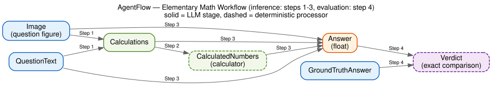

# AgentFlow

Agentflow is a framework for managing batch inferences and evaluation for agentic workflows.

Given some data for a task and some models available, it is 
necessary to experiment with multiple agent harnesses (agentic topology, 
prompts, in-context learning set up, and generation hyperameters) for evaluation 
purposes.

Features:

- Idempotency: never rerun inference on a finished stage or processed data item
- Convenient prompt management in actual text files, enabling hill-climbing with prompts.
- In-context learning support (configurable `num_shots`, `selection_strategy`, and `demo_pool`)
- Variety of supported model providers
- Media-first design, starting with images

How it works:

- It runs a sequence of processing stages over multiple data items.
- Each stage reads its inputs (either from the dataset or from a 
previous stage's outputs), calls a processor, and writes results to disk.
- All outputs are cached (index by (data item's ID and stage)) — re-running skips 
completed item/stage's automatically.

## Example: Elementary Math Problems

Let's consider the task of answering elementary math question in a photo:
```
Input: Image
Output: A real number
```

To reduce mathematical hallucinations, it is helpful to outsource the 
calculations into an actual calculator (which is just another agent). So you 
want to prototype the following workflow:

- Step 1: `Image` -> `QuestionText`
- Step 2: `QuestionText` -> `Calculations`
- Step 3: `Calculations` -> `CalculatedNumbers`
- Step 4: `QuestionText`, `Calculations`, `CalculatedNumbers` -> `Answer` (float)

Additionally, because we happen to have the ground truth answer to each 
question, we want the workflow to give us a binary verdict as well (which is 
another agent):

- Step 5: `GroundTruthAnswer`, `Answer` -> `Verdict`

So the whole agentic workflow, comprising inference (first 4 steps) and evaluation (the final step) is illustrated in the following graph:



To run the workflow with agentflow, do the following steps (which has been 
created in `test/`):

1. Prepare the dataset as a JSON file:

```json
// data/items.json
[
  {"id": "item_001", "data": {"image": "001.png", ...}},
  {"id": "item_002", "data": {"image": "002.png", ...}}
]
```

2. Put the images in `data/images/`.

```bash
#  inside `data/images/`
001.png
002.png
```

3. Write the prompts in `prompts/`.

4. Write the config in `pipeline.yaml`:

```yaml

```

6. Run the config:

```bash
python -m agentflow pipeline.yaml --prompt_dir prompts
```

<!-- ```python
# main.py
from agentflow.pipeline import Pipeline
net = Pipeline("pipeline.yaml", prompt_dir="prompts/")
net.execute_all()
``` -->

## Output layout

```
output/<pipeline-name>/
  <StageName>/
    <item_id>/
      output.json   # stage output (Pydantic model serialized to JSON)
      run.log       # model call log for this item
      demos.json    # (if demos enabled) list of selected demo item_ids
```

## Architecture

```
Config (YAML)
    │
    ▼
Pipeline
    ├── Loader  ──────── reads raw data items
    ├── Stage[]
    │     ├── Processor  ── transforms inputs → output
    │     └── Cache      ── reads/writes output.json per item
    └── Models dict  ──── lazily-initialized LLM/VLM clients
```

See [docs/](docs/) for detailed documentation on each component.

## Extending to a new domain

All extension is done via registration APIs — `agentflow/` itself never needs to be edited.

```python
from agentflow.pipeline import Pipeline
from agentflow.input_formater import InputFormater

# 1. Register output types
Pipeline.register_type("MyOutput", MyOutputModel)

# 2. Register custom input formats (optional)
InputFormater.register("my_format", my_format_handler)

# 3. Register custom model backends (optional)
Pipeline.register_model_backend("my_provider", MyLLMClass)
```

Then reference these names in YAML as normal. See [docs/extension_points.md](docs/extension_points.md) for the full reference.

## Running tests

Tests are split into two suites:

- `test/unit/` — pure unit tests (`InputFormater`, config validation). No server
  or API keys required.
- `test/integration/` — end-to-end pipeline runs over the example projects in
  [examples/](examples/). Each test module targets one example project
  (`test_captioning.py` → `examples/captioning`, `test_counting.py` →
  `examples/counting`, `test_hosted_models.py` → hosted OpenAI/Gemini backends).

The integration tests (except the hosted-model ones) need an OpenAI-compatible
server with vision support at `http://0.0.0.0:8000`, served via
[`llama.cpp`](https://github.com/ggml-org/llama.cpp). The lightweight
[SmolVLM-500M](https://huggingface.co/ggml-org/SmolVLM-500M-Instruct-GGUF)
(~1 GB, downloaded automatically on first run) is the default — structured JSON
output is grammar-enforced regardless of model size. In a separate terminal:

```bash
llama-server -hf ggml-org/SmolVLM-500M-Instruct-GGUF --host 0.0.0.0 --port 8000 -c 8192
```

The `-c 8192` (8K context) leaves room for the demo-shot prompts used by some
test configs. Once the server is up (`curl http://0.0.0.0:8000/health`), run
everything:

```bash
pytest test/ -v
```

Or just the local-server integration tests:

```bash
pytest test/integration/test_captioning.py test/integration/test_counting.py -v
```

Unit tests run without any server:

```bash
pytest test/unit/ -v
```

`test/integration/test_hosted_models.py` exercises the hosted OpenAI/Azure and
Gemini backends and needs API keys in `.env` (see `.env.example`), not the local
server.
